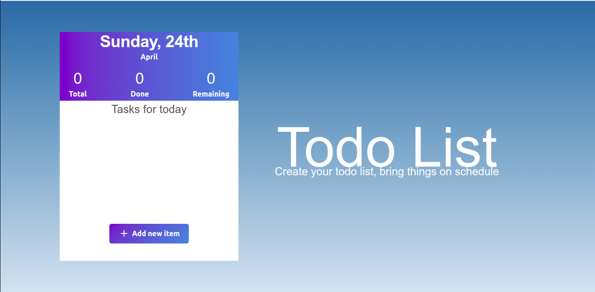
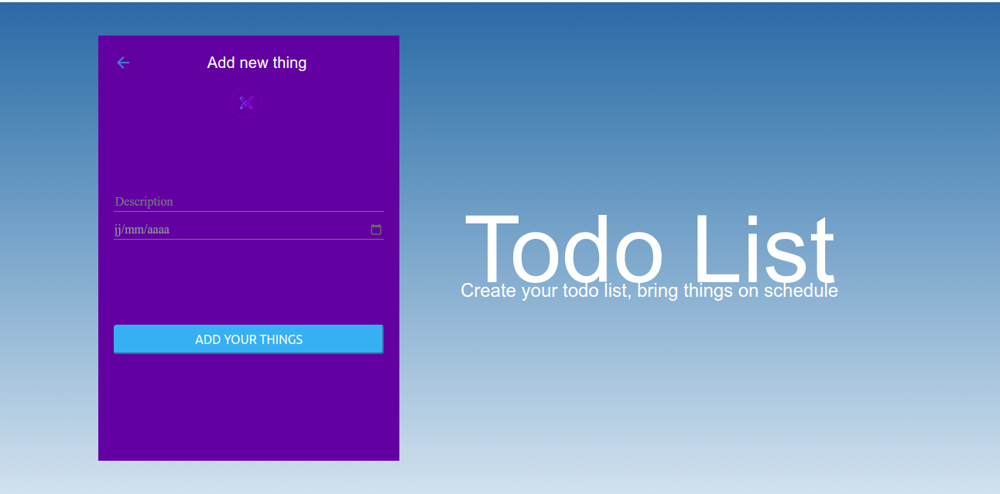

# TODOLIST
> In this Project, I created a TODO front-end on MVC architecture with CRUD principles , in order to allow users add, update, delete tasks and get a list of tasks.
## Project Preview

App-Preview                          
:---------------------------------------------------------------------------------:
  

Desktop-Home                             
:---------------------------------------------------------------------------------:


Desktop-Add-Item                             
:---------------------------------------------------------------------------------:



## Front-end Live Demo
> Click [here](https://todo-handson.netlify.app/) to see the live preview of the project.

> [link to Backend](https://github.com/Taher-web-dev/ToDo-HandsOn)

### Built With

- [React](https://es.reactjs.org/)
- [JS](https://www.javascript.com/)
- [HTML](https://www.w3schools.com/html/)
- [CSS](https://www.w3schools.com/css/)
- [REACT-BOOTSTRAP](https://react-bootstrap.github.io/)
- [@MUI/MATERIAL](https://mui.com/)

# Getting Started with Create React App

This project was bootstrapped with [Create React App](https://github.com/facebook/create-react-app).

### Installation

1. Clone the repository
   ```sh
   git clone https://github.com/Taher-web-dev/ToDo-HandsOn-Front-end
   ```
2. Install NPM packages
   ```sh
   npm install
   ```
3. Run server
   ```sh
   npm start
   ```
   
### Testing
   ```sh
   npm test
   ```
## Authors

👤 **Taher Haggui**

- GitHub: [@Taher-web-dev](https://github.com/Taher-web-dev)
- LinkedIn: [LinkedIn](https://www.linkedin.com/in/taher-haggui/)


## 🤝 Contributing

Contributions, issues, and feature requests are welcome!

Feel free to check the [issues page](../../issues/).


## Show your support

Give a ⭐️ if you like this project!
